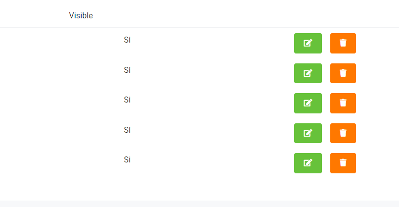

# Tarifas

Problema: En el apartado de tarifas, el problema radica en el mal nivelado de la fila de Visible
con las habitaciones que llevan el respectivo Si en ellas, lo que complica su visualización
al cliente.

Solucion: Equiparar los alineamientos de visible y lo que se encuentre debajo de su fila,
asi no sera inconveniente para cuando el cliente llegue a leerlo.

