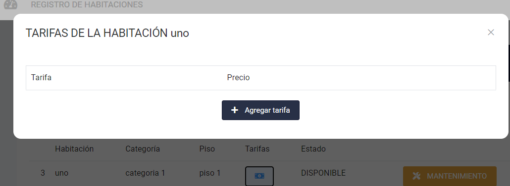

# Habitaciones

Problema: En la seccion de habitaciones, al presionar el boton para ver la tarifa que nos va a cobrar por la habitación 1
no es visible para el cliente, lo que es un inconveniente ya que el cliente no tiene conocimiento de los
precios

Solución: Corregir el tema de visibilidad del campo de tarifas para la vista de las habitaciones disponibles
asi facilitaria y ayudaria al cliente a saber el cobro correcto.
