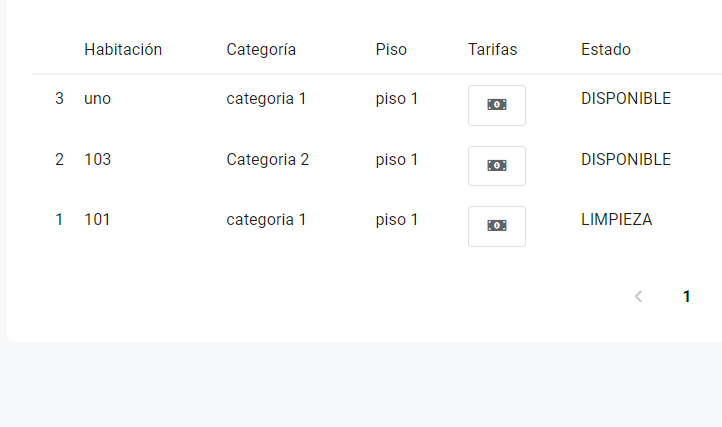
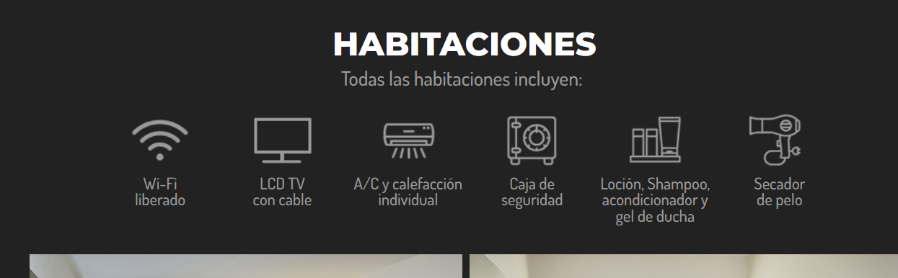
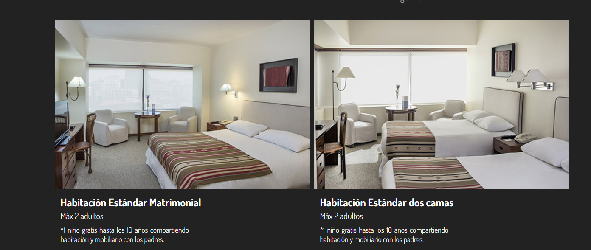

# Habitaciones

En el apartado de habitaciones se observa que no hay ninguna informacion acerca de las habitaciones
donde el cliente va a alojarse, lo que confundira al cliente y quedara insatisfecho ante
la falta de información

Lo que se podria implementar es unas breves frases de lo que ofreceria cada habitacion del hotel (sea matrimonial, personal, familiar)
señalarian sus beneficios mas importantes, asi despertando el interes de el cliente.

Tambien seria implementar lo que serian imagenes para que se pueda visualizar a lugar lo que es la habitación, indicando la categoria de la habitación y cuantas personas tiene de capacidad, gracias a esto, segun el gusto del cliente poder elegir el suyo a su favor.

