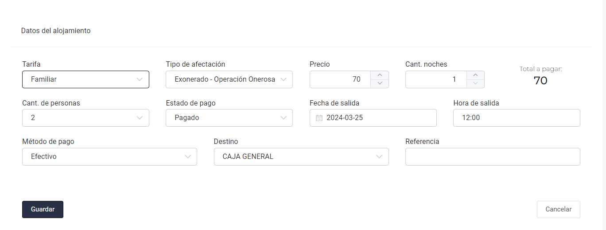

# Reserva

A la hora de hacer una reserva la información que piden es algo corta y simple, lo que se quiere es pasar de lo simple
a lo moderno, planteando hacer visible que beneficios trae al hacer la reserva, como el desayuno o comidas que el hotel
puede ofrecer, tambien explicar que descuentos se aplican al hacer una reserva (como en dias de cumpleaños, dias festivos, feriados, fines de semana, etc).

